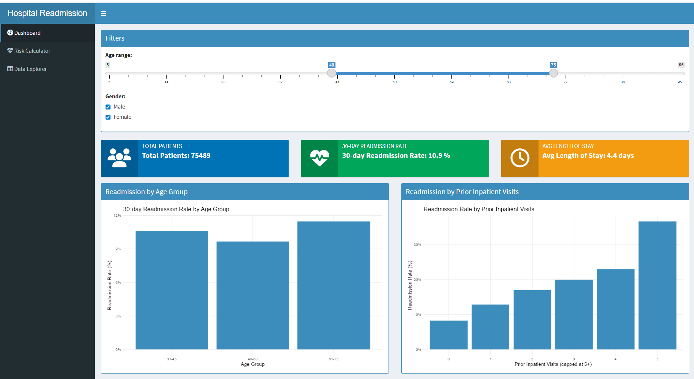
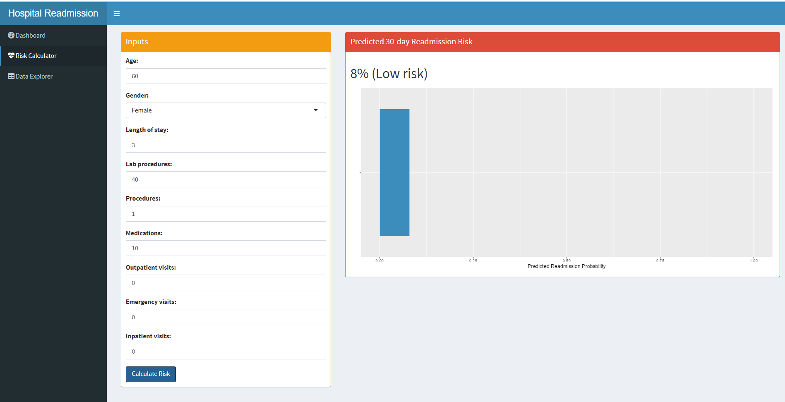
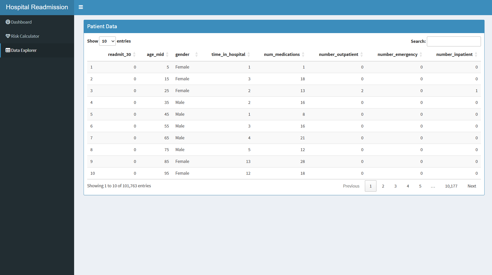

# 🏥 Hospital Readmission Analytics (R + Shiny)

This project analyzes **30-day hospital readmissions** using real-world patient encounter data and provides an **interactive R Shiny dashboard** for healthcare decision-makers.  
It demonstrates skills in **data cleaning**, **EDA**, **predictive modeling**, and **dashboard development** using R.

---

## 📌 Project Overview

Hospital readmissions are costly and often reflect issues in care quality.  
This project uses the **Diabetes 130-US Hospitals** dataset (100K+ encounters) to:

- Identify **patterns, drivers, and risk factors** behind 30-day readmissions  
- Build a **logistic regression model** that predicts readmission risk  
- Develop an **interactive Shiny dashboard** with KPIs, visualizations & a risk calculator  
- Provide a complete end-to-end healthcare analytics workflow

---

## 🚀 Features

### **📊 Dashboard**
- KPI Cards:
  - **Total Encounters**
  - **30-Day Readmission Rate**
  - **Average Length of Stay**
- Interactive filters:
  - Age range  
  - Gender  
- Visual Insights:
  - Readmission Rate by Age Group  
  - Readmission Rate by Prior Inpatient Visits  

### **❤️ Risk Calculator (ML-powered)**
Enter patient details to instantly predict:
- **Readmission probability (%)**
- **Risk category** (Low / Medium / High)
- Visualization of predicted probability

### **📋 Data Explorer**
- Full dataset view  
- Sorting, filtering, and searching  
- Helpful for validating insights or exploring segments

---

## 🧠 Data Source

**Diabetes 130-US Hospitals for Years 1999–2008**  
An open-source healthcare dataset widely used in medical AI research.

Dataset includes:
- 101,766 hospital encounters  
- Diagnoses & comorbidities  
- Procedures and medications  
- Lab results  
- Prior visits  
- **Readmission label: `<30`, `>30`, `NO`**  
- Patient demographics

---

## 🛠️ Tech Stack

- **R**
- **Shiny / shinydashboard**
- **dplyr**, **ggplot2**, **caret**, **pROC**, **scales**, **DT**
- **Logistic Regression Modeling**
- **Interactive Data Visualization**

---

## ⚙️ Workflow

### **1️⃣ Data Cleaning**
- Replaced `"?"` values with NA  
- Removed invalid gender values  
- Converted age brackets to numeric mid-points  
- Created binary target variable:  
  - `<30` → **1** (readmitted)  
  - `>30` / `NO` → **0**
- Selected clinically relevant features

### **2️⃣ Exploratory Data Analysis**
Key findings:
- 30-day overall readmission rate is **~11%**
- Higher risk in **older patients (61–75+)**
- Strong positive correlation between:
  - **prior inpatient visits** and **readmission risk**
  - **number of medications** and risk
- LOS (Length of Stay) varies across segments

### **3️⃣ Predictive Modeling**
A logistic regression model was trained to predict 30-day readmission using:
- Age  
- Gender  
- Length of stay  
- Lab procedures  
- Medications  
- Outpatient / Emergency / Inpatient visits  

Outputs:
- Predicted probability  
- AUC score (performance metric)  
- Saved model as RDS for Shiny integration

### **4️⃣ Shiny Dashboard Development**
- Fully interactive UI (shinydashboard)
- Healthcare color theme
- KPI value boxes
- Dynamic plots
- Real-time Risk Calculator + ML predictions
- Full Patient Data Explorer table

---

## 📸 Screenshots

### **Dashboard Overview**


### **Risk Calculator**


### **Data Explorer**



---

## 📁 Repository Structure

```text
Healthcare_Readmission/
│
├── data/
│ ├── diabetic_data.csv
│ │  
│ └── processed/
│ ├── diabetes_readmission_clean.csv
│ └── logit_model_readmit30.rds
│
├── Scripts/
│ ├── data_cleaning.R
│ └── 02_eda_modeling.R
│
├── app.R
├── screenshots/
│ ├── dashboard.png
│ ├── risk_calculator.png
│ └── data_explorer.png
│
└── README.md
```